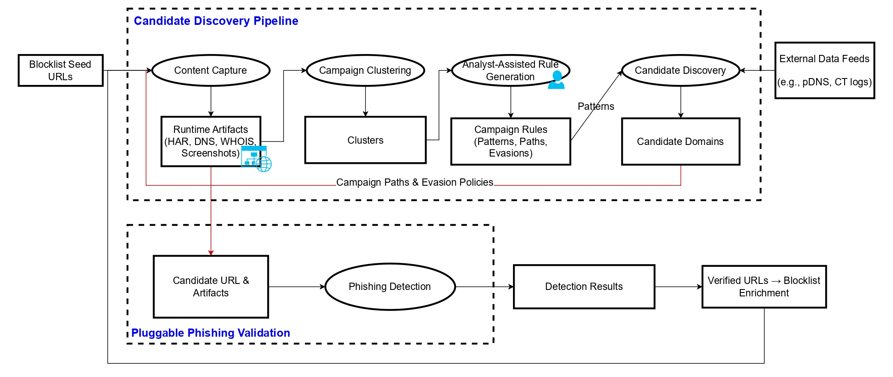

<h1 align="center" style="color:#2b7de9;">Campaign-Aware Phishing Discovery</h1>

<h2 style="color:#2b7de9;">📖 Overview</h2>

This repository contains the **research artifacts** accompanying our paper:

> **Following the Breadcrumbs: Campaign-Aware Phishing Discovery from Sparse Seeds**

Our goal is to support **reproducibility and artifact evaluation** by releasing the core components of our phishing campaign discovery pipeline.  
The full production pipeline is large and continuously running. This repository provides the **essential research modules** required to reproduce the methodology and experiments from the paper.

---

<h2 style="color:#2b7de9;">🔥 Key Contributions</h2>

We release the following components:

1. Content-based clustering module  
2. Graph-based phishing detection models  
3. Sample dataset  

---

<h2 style="color:#2b7de9;">🧩 Pipeline Summary</h2>

<p align="center">
  
</p>
<p align="center"><em>Figure 1: Campaign-aware phishing discovery pipeline.</em></p>

---

<h2 style="color:#2b7de9;">1️⃣ Content-Based Clustering</h2>

We provide a content-driven clustering module that groups phishing seed URLs into **infrastructure/content clusters**.  
Each URL instance (`sid`) is represented by the set of **content identifiers** observed in its HAR trace (md5-linked requests), with a fallback to stable URL-path identifiers when content is unavailable.  
We compute pairwise similarity and cluster sids via a **thresholded similarity graph and connected components**.

---

### 🧪 Running the Clustering Module

The clustering module expects a **pandas DataFrame** containing URL instances enriched with HAR logs and extracted content metadata.

#### Expected Input Schema

| Column | Description |
|---|---|
| `sid` | Unique identifier for the URL instance |
| `root_url` | Landing URL of the page |
| `har_logs` | List of HAR request objects |
| `content_files` | List of extracted content file objects |

#### Example HAR entry

#### Example HAR entry

```python
{
  "id": "request_1",
  "url": "https://example.com/js/app.js",
  "status": 200
}
```

#### Example content file entry

```python
{
  "md5": "098f6bcd4621d373cade4e832627b4f6",
  "requestId": "request_1"
}
```

<h2 style="color:#2b7de9;">2️⃣ Graph-Based Phishing Detection (G2)</h2>

We release our **best-performing phishing detection model** based on a
3-layer **Heterogeneous GraphSAGE (G2)** architecture.

The model operates on a heterogeneous graph capturing relationships between
URLs and infrastructure resources observed during page loading.


The model performs **node classification on URL nodes**
to predict <b>phishing vs benign</b>.

<h3>Released Artifacts</h3>

We provide all components required to run inference:

• Trained G2 Heterogeneous GraphSAGE model  
• Base heterogeneous graph used during training  
• Frozen feature vocabulary (<code>vocab.json</code>)  
• Inference utilities for merging user data into the graph  

📁 <code>GNN-G2/</code>

<h3>Using the Model on New Data</h3>

Users must construct feature tensors using test data
following the provided vocabulary ordering:

Required tensors:

• <code>new_url_x</code> — URL node features  (N × D_url)  
• <code>new_har_x</code> — HAR node features  (M × D_har)  
• <code>edge_url_har</code> — URL → HAR edges (local indices)  
• <code>edge_har_url</code> — HAR → URL edges (local indices)  
• <code>edge_attr</code> — optional edge attributes  


<h3>Inference Output</h3>

The model outputs for each URL:

• predicted label (0 = benign, 1 = phishing)  

This reproduces the detection stage described in the paper.
